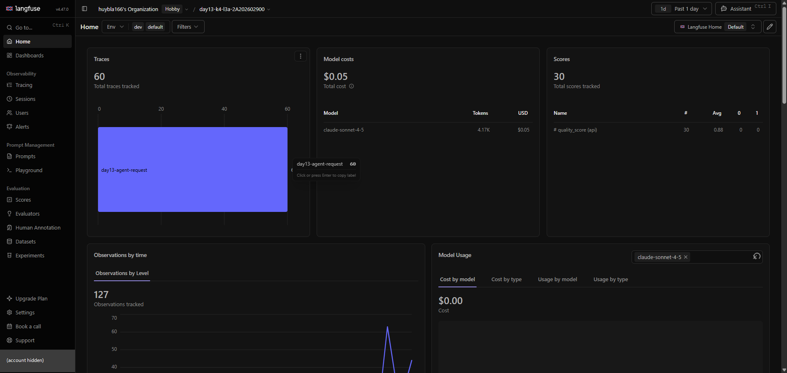

# Báo cáo cá nhân — K4-L3A Day 13 Monitoring & LLMOps

> Mỗi học viên hoàn thiện một file duy nhất này. Khi dẫn evidence, dùng đường dẫn tương đối, ví dụ `evidence/07-trace-waterfall.png`.

## 1. Thông tin học viên

- **Họ và tên:** Phạm Quang Huy
- **MSSV:** 2A202602900
- **Lớp:** K4-L3A
- **Repository URL:** https://github.com/huybla166/K4-L3-DAY13-PhamQuangHuy-2A202602900-Monitoring-LLMOps
- **Commit SHA cuối:** `eed15d40129c6a2bb1a3c2cd55b3299cc8a2e254`
- **Challenge ID:** `day13-k4-l3a-monitoring-llmops-v1`
- **Tên project Langfuse cá nhân:** `day13-k4-l3a-2A202602900`

## 2. Evidence index

Điền đúng đường dẫn tới evidence thực tế. Có thể đổi tên hoặc dùng nhiều ảnh nếu cần.

| Evidence | Đường dẫn |
|---|---|
| Pytest cuối | [`evidence/01-pytest.txt`](evidence/01-pytest.txt) |
| Log validator | [`evidence/02-log-validator.txt`](evidence/02-log-validator.txt) |
| Dashboard validator | [`evidence/03-dashboard-validator.txt`](evidence/03-dashboard-validator.txt) |
| Structured log | [`evidence/04-structured-log.txt`](evidence/04-structured-log.txt) |
| PII redaction | [`evidence/05-pii-redaction.txt`](evidence/05-pii-redaction.txt) |
| Trace list | [`evidence/06-trace-list.png`](evidence/06-trace-list.png) |
| Trace waterfall | [`evidence/07-trace-waterfall.png`](evidence/07-trace-waterfall.png) |
| Trace metadata | [`evidence/08-trace-metadata.png`](evidence/08-trace-metadata.png) |
| Prompt versions | [`evidence/09-prompt-versions.png`](evidence/09-prompt-versions.png) |
| Prompt rollback | [`evidence/10b-prompt-rollback-v1.png`](evidence/10b-prompt-rollback-v1.png) |
| Dashboard runtime | [`evidence/11-dashboard-overview.png`](evidence/11-dashboard-overview.png) |
| Incident metric | [`evidence/12-incident-metric.png`](evidence/12-incident-metric.png) |
| Incident log | [`evidence/13-incident-log.txt`](evidence/13-incident-log.txt) |
| Incident trace | [`evidence/14-incident-trace.png`](evidence/14-incident-trace.png) |

## 3. Kết quả kỹ thuật

| Nội dung | Baseline | Kết quả cuối | Nhận xét |
|---|---|---|---|
| `validate_logs.py` | 30/100 (41 dòng; 40 thiếu field/context, 0 correlation ID) | 100/100 (sau CP1) | Baseline thiếu `correlation_id` và context request. Sau CP1 có middleware và `bind_contextvars`. Chạy lại ngày 29/09 trên toàn bộ `data/logs.jsonl` (156 record, 72 correlation ID) vẫn đạt 100/100. |
| `validate_dashboard.py` | 6/6 | 6/6 (sau CP2) | Contract `config/dashboard.yaml` đã đủ 6 panel từ đầu. Phần tôi làm là dashboard runtime `GET /dashboard` đọc đúng contract này. |
| `pytest` | 22 passed | 35 passed (sau CP2; thêm 9 test PII, 4 test dashboard) | Chạy lại ngày 29/09 trên working tree cuối: vẫn 35 passed. |
| Số traces hợp lệ | | 60 traces trong project Langfuse (ảnh 11; 48 lúc CP2, ảnh 06) | Mỗi trace có root `lab-agent-run` và 3 observation con. Metadata của trace có `correlation_id` khớp với log. |
| Số PII leak | 0 | 0 (sau CP1) | Các giá trị PII giả trong `data/sample_queries.jsonl` không còn nguyên văn trong log. Trong log chỉ còn `[REDACTED_*]`. |
| Latency P95 / TTFT P95 | | 6180 ms / 50 ms (dashboard 60 phút lúc CP2, ảnh 11) | P95 vượt SLO 3000 ms. Nguyên nhân là `prompt-fetch` phải fetch lại prompt khi cache hết hạn (xem mục 8), không phải LLM, vì TTFT luôn giữ ở khoảng 50 ms. Ảnh dashboard lúc CP2 nằm ở commit `ea99a54`. |
| Retrieval success rate | | 100% (dashboard lúc CP2) | Không có `request_failed`. Mọi `response_sent` đều có `tool_success=true`, kể cả lúc xảy ra sự cố. |

## 4. Logging và PII

- **Cách tạo/nhận và truyền correlation ID:** `CorrelationIdMiddleware` ([`app/middleware.py`](../app/middleware.py)) chạy ở đầu mỗi request. Middleware làm các bước sau:
  1. Gọi `clear_contextvars()` để context của request trước không rò sang request này.
  2. Đọc header `x-request-id`. Header chỉ được dùng nếu khớp `^[A-Za-z0-9._-]{1,64}$`; header quá dài, có khoảng trắng hoặc có thể chứa PII thì bị bỏ, và middleware sinh ID mới `req-<8 hex>` từ `uuid4`.
  3. `bind_contextvars` ID này cho structlog và lưu vào `request.state.correlation_id`.
  4. Trả lại ID qua response header `x-request-id` (kèm `x-response-time-ms`) và trong body `ChatResponse.correlation_id`.
  5. Truyền ID vào `LabAgent.run(correlation_id=...)` để ghi vào metadata của trace.

  Ví dụ: `req-7780c057` giống nhau ở header, body và cả hai dòng log của request ([`evidence/04-structured-log.txt`](evidence/04-structured-log.txt)).
- **Các metadata được ghi vào structured log:** Processor chain ([`app/logging_config.py`](../app/logging_config.py)) merge contextvars và thêm `level` cùng `ts` (ISO-8601 UTC). Trong `/chat` ([`app/main.py`](../app/main.py)) tôi bind `user_id_hash`, `session_id`, `feature`, `model` và `env`, nên mọi dòng log của một request có cùng context. Mỗi dòng có `service` và `event`. Các field riêng theo event:
  - `request_received`: `payload.message_preview`.
  - `response_sent`: `latency_ms`, `ttft_ms`, `tokens_in`, `tokens_out`, `cost_usd`, `quality_score`, `tool_name`, `tool_success` và `payload.answer_preview`.
  - `request_failed`: `error_type` và `payload.detail`.

  Log được ghi ra stdout và `data/logs.jsonl`. File này có trong `.gitignore`.
- **Cách bảo đảm PII được scrub trước khi ghi:** PII được chặn ở hai lớp:
  1. Tại nguồn: log không ghi `user_id` mà chỉ ghi `user_id_hash` (SHA-256 rút gọn 12 ký tự). Message chỉ được log qua `summarize_text()`, hàm này scrub rồi cắt còn 80 ký tự.
  2. Processor `scrub_event` scrub đệ quy mọi chuỗi, kể cả trong dict/list lồng nhau. Processor này nằm **sau** `format_exc_info`, vì traceback cũng có thể chứa PII, và **trước** `JsonlFileProcessor`/`JSONRenderer`. Vì vậy không có đường nào ghi ra file hoặc stdout mà bỏ qua bước scrub.

  Regex trong [`app/pii.py`](../app/pii.py) che email, thẻ 16 số (4-4-4-4), thẻ Amex 15 số, CCCD 12 số, điện thoại Việt Nam (`0`/`84`/`+84`/`(+84)` + 9 số, cho phép dấu cách/chấm/gạch) và hộ chiếu Việt Nam. Pattern thẻ chạy trước CCCD và điện thoại, nếu không pattern ngắn hơn có thể khớp một phần số thẻ và để lộ phần còn lại.

  Phía trace, mọi `@observe` đặt `capture_input=False, capture_output=False` và chỉ gửi preview đã scrub. `user_id` trên trace cũng là hash.
- **Cách kiểm chứng kết quả:**
  - 11 test trong [`tests/test_pii.py`](../tests/test_pii.py) kiểm tra từng loại PII, nhiều PII trong một câu, và số không phải PII không bị che nhầm.
  - `validate_logs.py` báo 0 PII leak ([`evidence/02-log-validator.txt`](evidence/02-log-validator.txt)).
  - Tôi grep các giá trị PII giả của `data/sample_queries.jsonl` (email của u01, điện thoại của u05, thẻ của u09) trong `data/logs.jsonl`: không còn giá trị nào, log chỉ còn `[REDACTED_EMAIL]`, `[REDACTED_PHONE_VN]`, `[REDACTED_CREDIT_CARD]` ([`evidence/05-pii-redaction.txt`](evidence/05-pii-redaction.txt)).

## 5. Tracing và prompt versioning

- **Cách xác nhận traces do chính tôi tạo trong project cá nhân:** `.env` (không commit) dùng key của project `day13-k4-l3a-2A202602900`, và tên project này hiện trên breadcrumb của các ảnh Langfuse 06, 07/08, 11, 12 và 14. Tôi tự tạo toàn bộ traces bằng `load_test.py`, `curl` và các request prompt versioning. `correlation_id` trong metadata của các trace khớp với log trong `data/logs.jsonl` trên máy tôi. Ví dụ log `req-cb4af3aa` khớp với trace `adda6b1a…`, và `user_id_hash` `aae0b94055a9` giống nhau ở cả log và trace. Ảnh 06 (lọc Past 1 day) có 48 root observation `lab-agent-run`; ảnh 11 có 60 traces `day13-agent-request`.
- **Cấu trúc root/retrieval/generation observations:** Cấu trúc nằm trong [`app/agent.py`](../app/agent.py).
  - Root `lab-agent-run` (type `agent`, trace name `day13-agent-request`). `propagate_attributes` gắn các trace attribute: `user_id` (hash), `session_id`, tags `[lab, <feature>, <model>]`, `environment` và metadata `{feature, model, correlation_id}`. Trace còn có score `quality_score`.
  - `@observe` tự lồng ba observation con dưới root theo context:
    1. `retrieval` (retriever): `query_preview`, `doc_count`, `doc_previews`, `retrieval_ms`.
    2. `prompt-fetch` (span): `prompt_name`, `prompt_label`, `prompt_version`, `prompt_source`, `prompt_fetch_error`. Level là `WARNING` khi app phải dùng `local-fallback`.
    3. `llm-generation` (generation): model `claude-sonnet-4-5`, `usage_details` input/output, `cost_details` tính theo giá 3/15 USD mỗi 1M token, `completion_start_time` để Langfuse tính TTFT, và link tới managed prompt.

  Waterfall ở ảnh 07 (trace `3a8e5ed9…`, dạng tree): root 1.69 s, `prompt-fetch` 1.53 s, `llm-generation` 0.15 s, 195 tokens, $0.002493. Ảnh 14 là dạng timeline của trace sự cố.
- **Cách nối trace với log:** Cùng một `correlation_id` có trong mọi dòng log của request và trong metadata của trace. Trên Langfuse tôi lọc theo metadata `correlation_id` (hoặc đọc cột Metadata ở ảnh 06). Ví dụ: log `req-cb4af3aa` (ảnh 13) nối với trace `adda6b1a9c5f3273da4cee16db5fc785` (ảnh 14); `req-prompt-promoted-v2` nối với trace `3a8e5ed94a6a3a155a4622d095349a07` (ảnh 08).
- **Prompt name:** `day13-chat`
- **Version/label baseline:** version 1 — labels `baseline`, `production`
- **Version/label candidate:** version 2 — label `candidate` (thêm dòng "Answer in at most 3 sentences.")
- **Trace ID của mỗi version:**
  - v1 (`baseline`, `req-prompt-baseline-2`): `4802e2df111775f853dc28d2d93de5c6`
  - v2 (`candidate`, `req-prompt-candidate-2`): `8379ffb2c69ef74464690c468f2a4f98`
  - v2 sau khi promote `production` (`req-prompt-promoted-v2`): `3a8e5ed94a6a3a155a4622d095349a07`
  - v1 sau khi rollback `production` (`req-prompt-rollback-v1`): `6a6141a1a8760c68e576675ccecb2398`
- **Cách promote và rollback `production`:** App lấy prompt theo `LANGFUSE_PROMPT_NAME=day13-chat` và `LANGFUSE_PROMPT_LABEL` (mặc định `production`), cache 60 s ([`app/prompt_management.py`](../app/prompt_management.py)). Vì vậy muốn đổi version chỉ cần chuyển label, không phải sửa hay deploy code. Các bước tôi đã làm:
  1. Chạy cùng một input (`feature=qa`, "How should alerts be designed?") với label `baseline` và `candidate` để có trace của v1 và v2.
  2. **Promote:** `update_prompt(name="day13-chat", version=2, new_labels=["candidate", "production"])`. Mỗi label chỉ gắn với một version, nên `production` tự bị gỡ khỏi v1. Sau đó tôi chạy request với label `production`: trace `3a8e5ed9…` ghi `prompt_version=2`, `prompt_label=production` (ảnh 07/08, trạng thái **trước** rollback).
  3. **Rollback:** `update_prompt(name="day13-chat", version=1, new_labels=["baseline", "production"])`. Label `production` quay về #1 (ảnh 10b: `#1 production baseline`, `#2 latest candidate`), và request tiếp theo dùng lại v1 (trace `6a6141a1…`).

  Sau mỗi lần đổi label, tôi đọc lại bằng `get_prompt(..., cache_ttl_seconds=0)` để xác nhận. Trạng thái sau rollback vẫn giữ đến lúc làm challenge: trace sự cố ở ảnh 14 ghi `prompt_version=1`, `prompt_label=production`.

## 6. Dashboard, SLO và alerts

- **Dashboard và sáu panel:** Dashboard runtime `GET /dashboard` ([`app/dashboard.py`](../app/dashboard.py)) đọc `data/logs.jsonl` theo contract [`config/dashboard.yaml`](../config/dashboard.yaml): time range 60 phút, tự refresh mỗi 30 s. Mỗi panel ghi đơn vị, vẽ đường threshold đỏ nét đứt và có badge OK/BREACH.

  | Panel | Đơn vị | Threshold |
  |---|---|---|
  | Latency P50/P95/P99 và TTFT P95 | ms | P95 ≤ 3000 (SLO) |
  | Request traffic | requests/min | ≥ 1 |
  | Error rate và retrieval success | % | error rate ≤ 2 |
  | Cost over time | USD | tổng ≤ 2.5 |
  | Input/output tokens | tokens | tổng ≤ 50000 |
  | Quality proxy | điểm 0–1 | mean ≥ 0.75 |

  Ảnh chụp `/dashboard` lúc CP2 nằm trong [commit `ea99a54`](https://github.com/huybla166/K4-L3-DAY13-PhamQuangHuy-2A202602900-Monitoring-LLMOps/blob/ea99a54/submission/evidence/11-dashboard-overview.png): P95 6180 ms (BREACH), TTFT P95 50 ms, error rate 0 %, retrieval success 100 %, tổng cost 0.0546 USD, tokens in/out 906/3459, quality 0.875.

  Ảnh evidence hiện tại (ảnh 11) là trang Home của project Langfuse cá nhân (Past 1 day). Ảnh này cho thấy cùng các tín hiệu nhưng lấy từ trace:
  - Traces: 60 (traffic).
  - Model costs: $0.05 và 4.17K tokens (cost, tokens).
  - Scores: `quality_score` trung bình 0.88 trên 30 trace (quality).
  - Observations by level (errors).

  Latency percentiles theo trace và theo observation nằm ở [`evidence/12-incident-metric.png`](evidence/12-incident-metric.png).
- **SLO và lý do chọn:** SLO `fast_successful_requests` trong [`config/slo.yaml`](../config/slo.yaml): trong cửa sổ 28 ngày, ít nhất 99.5 % request phải vừa thành công vừa nhanh.
  - SLI = số `response_sent` có `latency_ms ≤ 3000` / số `request_received`. Request lỗi không có `response_sent`, nên tự động bị tính là xấu. Nhờ vậy một SLI đo được cả availability lẫn latency.
  - Tôi chọn 3000 ms vì baseline có P50 = 454 ms và TTFT P95 = 50 ms. 3 s gấp khoảng 6 lần request bình thường, là mức người dùng bắt đầu thấy chậm, nhưng không sát baseline đến mức gây báo động giả.
  - Baseline P95 = 3488 ms nhưng tôi không nới ngưỡng. Các request trên 3 s đều do `prompt-fetch` phải fetch lại prompt khi cache hết hạn; đó là thứ cần sửa, không phải lý do để nới SLO.
  - Kèm theo SLO là các guardrail: error rate ≤ 2 %, retrieval success ≥ 90 %, cost ≤ 2.5 USD/ngày, quality ≥ 0.75.
- **Cách tính error budget:** Error budget = 100 % − 99.5 % = 0.5 % số request trong 28 ngày.
  - Ví dụ ở mức 10 request/phút: 10 × 60 × 24 × 28 = 403 200 request, tức được phép tối đa 0.5 % × 403 200 = 2 016 request chậm hoặc lỗi. Quy ra thời gian: 0.5 % × 28 ngày = 3.36 giờ nếu mọi request đều xấu.
  - Burn rate = tỉ lệ request xấu / 0.5 %. Burn rate 14.4 kéo dài 1 giờ tiêu 14.4/672 ≈ 2.14 % budget của cửa sổ 28 ngày thì page on-call. Khi đã tiêu 50 % budget thì dừng deploy tính năng mới và ưu tiên sửa độ tin cậy.
  - Áp vào challenge: 1/5 request (5373 ms) vượt 3000 ms, tức 20 % request xấu trong phút đó, tương ứng burn rate 40 nếu tình trạng kéo dài.
- **Ba alert và runbook tương ứng:** Alert khai báo trong [`config/alert_rules.yaml`](../config/alert_rules.yaml), runbook trong [`docs/alerts.md`](../docs/alerts.md). Cả ba đều symptom-based, owner là Phạm Quang Huy, gửi về Slack `#day13-k4-l3a-alerts`.

  | Alert | Severity | Điều kiện | Duration | Runbook |
  |---|---|---|---|---|
  | `HighLatencyP95` | P2-warning | P95 `latency_ms` (`response_sent`) trong 5 phút > 3000 ms | 5m | [Alert 1](../docs/alerts.md#alert-1) |
  | `HighErrorRate` | P1-critical | `request_failed / request_received` > 2 % **hoặc** retrieval success < 90 % | 5m | [Alert 2](../docs/alerts.md#alert-2) |
  | `CostBurnSpike` | P3-warning | Cost trung bình mỗi request trong 10 phút > 0.004 USD (≈ 2 lần baseline 0.00196) **hoặc** tổng cost 1 giờ > 0.104 USD (= 2.5/24) | 10m | [Alert 3](../docs/alerts.md#alert-3) |

  Mỗi runbook ghi ảnh hưởng tới người dùng, ba bước kiểm tra đầu tiên theo thứ tự Metrics → Logs → Traces, và mitigation tạm thời.

## 7. Điều tra challenge

- **Challenge ID:** `day13-k4-l3a-monitoring-llmops-v1` (cohort K4)
- **Khoảng thời gian điều tra:** 2026-09-29 09:05:34–09:05:51 UTC (inject + `load_test.py --challenge --concurrency 5`); kiểm chứng sau fix lúc 09:07:21 UTC
- **Triệu chứng từ metrics:** panel Latency — P50 = 2659 ms, P95 = 5373 ms trên 5 request challenge (baseline median 492 ms; ngưỡng SLO P95 ≤ 3000 ms). TTFT P95 = 50 ms, error rate 0%, retrieval success 100%, cost/tokens/quality bình thường. Phía client mỗi request mất ≈ 16.4 s.
- **Log line và correlation ID liên quan:** `req-cb4af3aa` — `response_sent`, `feature=monitoring`, `latency_ms=2659`, `ttft_ms=50`, `tool_success=true` (xem `evidence/13-incident-log.txt`)
- **Trace ID và span gây ảnh hưởng:** `adda6b1a9c5f3273da4cee16db5fc785` — root `lab-agent-run` 2.66 s, span `retrieval` 2.50 s, `prompt-fetch` 0.00 s, `llm-generation` 0.15 s; cả 5 trace của sự cố đều có `retrieval` ≈ 2.50 s
- **Root cause:** Bước retrieval (vector store) bị chậm. Sự cố `rag_slow` được bật lúc 09:05:35 UTC (log `incident_enabled`, `payload.name=rag_slow`), làm `retrieve()` trong [`app/mock_rag.py`](../app/mock_rag.py) chờ 2.5 s trước khi trả kết quả. Chuỗi bằng chứng:
  1. Metric: latency tăng (median 492 → 2659 ms), còn TTFT (50 ms), error rate và token/cost không đổi. Như vậy nguyên nhân không nằm ở LLM và cũng không phải lỗi.
  2. Log `req-cb4af3aa`: request chậm nhưng vẫn thành công (`tool_success=true`).
  3. Trace có cùng `correlation_id`: `retrieval` chiếm 2.50/2.66 s (≈ 94 %) của root, trong khi `prompt-fetch` (4 ms) và `llm-generation` (152 ms) bình thường. Bảng Observation latency ở ảnh 12 cũng cho `retrieval` p95 = 2.50 s.

  Có thêm một yếu tố làm sự cố nặng hơn: `/chat` là `async def` nhưng gọi `agent.run()` đồng bộ (bên trong có `time.sleep`), nên event loop bị chặn và 5 request đồng thời bị xử lý lần lượt. Trong log, `request_received` của request sau chỉ xuất hiện đúng lúc `response_sent` của request trước. Vì thế `latency_ms` phía server chỉ khoảng 2.66 s nhưng client phải chờ khoảng 16 s.
- **Fix action:**
  1. Giảm thiểu ngay theo runbook Alert 1: tắt nguồn gây chậm bằng `python scripts/inject_incident.py --disable` (gọi `POST /incidents/rag_slow/disable`) lúc 09:07:21 UTC (log `incident_disabled`).
  2. Kiểm chứng: chạy lại đúng 5 query challenge (`load_test.py --challenge --concurrency 5`) lúc 09:07:22 UTC. Kết quả: `latency_ms` 152–155 ms (P95 155 ms), TTFT 50–51 ms, 0 lỗi, retrieval thành công 5/5, thấp hơn cả median baseline 492 ms. Ví dụ `req-76f21619` hỏi cùng câu với `req-cb4af3aa` chỉ mất 152 ms.
- **Preventive measure:**
  1. Đặt timeout và fallback cho retrieval (ví dụ 1 s). Quá hạn thì trả lời bằng fallback không dùng RAG và log `tool_success=false`, để một vector store chậm không kéo chậm cả request, và alert `HighErrorRate` (retrieval success < 90 %) sẽ bắt được.
  2. Không chặn event loop: đổi `chat` thành `def` để FastAPI chạy trong threadpool, hoặc dùng `await run_in_threadpool(agent.run, ...)`. Đồng thời đo latency SLI ở middleware (`x-response-time-ms`) để tính cả thời gian chờ. Hiện `latency_ms` đo trong `agent.run`, nên 4/5 request (khoảng 2.65 s) vẫn được SLI tính là "tốt" dù client chờ khoảng 16 s.
  3. Thêm tín hiệu theo từng thành phần: ghi `retrieval_ms` vào log `response_sent` (hiện mới chỉ có trong trace) và thêm alert "retrieval P95 > 1000 ms trong 5 phút". `HighLatencyP95` có duration 5m nên không kịp bắt một đợt chậm khoảng 17 s như trong challenge; nó chỉ bắt được nếu sự cố kéo dài.

## 8. Giải thích và tự đánh giá

- **Một quyết định kỹ thuật quan trọng và lý do:** Tôi scrub PII tập trung trong một structlog processor (`scrub_event`) thay vì gọi `scrub_text` rải rác ở từng chỗ log. Processor này scrub đệ quy mọi field và nằm sau `format_exc_info`, trước bước ghi file/render. Lý do:
  1. Mọi log, kể cả event thêm sau này, `payload.detail` của exception và traceback, đều đi qua một điểm duy nhất, nên không thể quên scrub.
  2. Vị trí của processor quyết định kết quả: nếu scrub trước `format_exc_info` thì traceback được render sau đó vẫn chứa PII; nếu scrub sau `JsonlFileProcessor` thì PII đã bị ghi vào file.

  Phía trace, tôi tắt `capture_input`/`capture_output` và chỉ gửi preview đã scrub, vì Langfuse là hệ thống bên ngoài nên nguyên tắc là không gửi PII đi, thay vì gửi rồi mới che. Đánh đổi: regex có thể che nhầm chuỗi số dài không phải PII, nên tôi thêm test `test_scrub_keeps_non_pii_numbers`.
- **Một lỗi/blocker đã gặp:** Ở baseline, P95 latency là 3488 ms (lúc CP2, dashboard báo P95 6180 ms BREACH), trong khi TTFT P95 chỉ 50 ms và `llm-generation` khoảng 150 ms. Trên trace, root dài hơn nhiều so với tổng các span con, để lại một khoảng trống không rõ thời gian đi đâu.
- **Cách tìm nguyên nhân và xử lý:** Tôi đi theo luồng Metrics → Logs → Traces:
  1. Lọc log `response_sent` có `latency_ms > 3000` và lấy `correlation_id`.
  2. Mở trace tương ứng: khoảng trống nằm giữa `retrieval` và `llm-generation`, đúng chỗ `resolve_prompt()` gọi `get_prompt()` của Langfuse (timeout 2 s, cache 60 s) ngay trên đường request.
  3. Tách bước này thành span `prompt-fetch`, ghi `prompt_source` và `prompt_fetch_error`, đặt level `WARNING` khi fallback, để thời gian này hiện rõ trên waterfall. Ví dụ trace `3a8e5ed9…` có `prompt-fetch` 1.53 s trên root 1.69 s (ảnh 07); bảng Observation latency cho `prompt-fetch` p95 5.46 s (ảnh 12).

  Khi đã rõ nguyên nhân, tôi giữ ngưỡng SLO 3000 ms và ghi lý do vào `config/slo.yaml`, thay vì nới SLO cho khớp baseline. Hướng sửa tiếp theo: làm ấm cache prompt lúc app khởi động và refresh cache ở nền, để việc fetch prompt không nằm trên đường request.
- **Cách hiểu luồng Metrics → Logs → Traces:** Mỗi tầng trả lời một câu hỏi khác nhau:
  - Metrics cho biết có vấn đề không, bắt đầu lúc nào và nặng đến đâu. Metrics là số tổng hợp nên rẻ và hợp để alert, nhưng không cho biết request cụ thể nào bị ảnh hưởng.
  - Logs cho biết request nào bị ảnh hưởng và trong ngữ cảnh gì: mỗi dòng có `correlation_id`, feature, model, latency, `tool_success`.
  - Traces cho biết thời gian hoặc lỗi nằm ở bước nào, qua waterfall cha-con của một request.

  `correlation_id` là khóa nối log với trace. Trong challenge, chuỗi điều tra là:
  1. Metric latency tăng quanh 09:05 UTC (P50 2659 ms, P95 5373 ms) trong khi TTFT, error rate và cost bình thường.
  2. Log `req-cb4af3aa` (`latency_ms=2659`, `tool_success=true`).
  3. Trace `adda6b1a…` có cùng `correlation_id`.
  4. Span `retrieval` chiếm 2.50/2.66 s.
  5. Root cause: retrieval chậm (`rag_slow`), sau đó fix và kiểm chứng lại bằng chính metric (P95 155 ms).

  Mỗi tầng loại trừ bớt giả thuyết: TTFT bình thường loại LLM, `tool_success=true` loại lỗi, còn trace chỉ ra đúng span gây chậm.
- **Vai trò của prompt version, token/cost, SLO hoặc rollback trong vận hành LLM:**
  - Prompt thay đổi hành vi mô hình giống code nhưng không đi qua quy trình deploy, nên phải có version. Mỗi generation gắn `prompt_name/version/label`, nên khi quality, cost hay latency thay đổi có thể quy về đúng version và so sánh baseline với candidate trên cùng input.
  - Label `production` tách chuyện "version nào đang chạy" ra khỏi code. Nhờ vậy rollback chỉ là chuyển label, có hiệu lực trong tối đa 60 s (thời gian cache), nhanh và an toàn hơn revert commit.
  - Token/cost là chỉ số vận hành riêng của LLM: prompt hoặc output dài hơn làm cost tăng tuyến tính mà không sinh ra lỗi nào, nên cần panel cost/tokens và alert `CostBurnSpike`.
  - SLO và error budget biến câu hỏi "chậm hoặc lỗi bao nhiêu là chấp nhận được" thành con số, dùng để quyết định khi nào page on-call và khi nào dừng promote prompt hay tính năng mới.
- **Điều quan trọng nhất đã học:** Observability chỉ có giá trị khi các tín hiệu nối được với nhau. Khi `correlation_id` có mặt ở header, log và trace metadata, tôi đi từ một điểm bất thường trên dashboard tới đúng span gây chậm trong vài phút. Tôi cũng học được rằng đo ở đâu quyết định thấy được gì: `latency_ms` đo trong agent chỉ là 2.66 s, còn client thực tế chờ 16 s.
- **Hạn chế hoặc phần chưa hoàn thành, nếu có:**
  - LLM và RAG đều là mock. `quality_score` chỉ là heuristic (có tài liệu, độ dài câu trả lời, trùng từ khóa), không phải đánh giá chất lượng thật.
  - SLO và alert mới ở dạng cấu hình khai báo kèm runbook, chưa nối với hệ thống alert/Slack thật và chưa tự động tính burn rate.
  - `/dashboard` đọc toàn bộ `data/logs.jsonl` mỗi lần render, đủ cho lab nhưng không mở rộng được cho production.
  - Có hai vấn đề đã phân tích nhưng chưa sửa trong code: `prompt-fetch` vẫn nằm trên đường request, và `/chat` vẫn chặn event loop khi retrieval chậm (xem phần preventive measure ở mục 7).

## 9. Checklist trước khi nộp

- [x] Kết quả và evidence thuộc commit SHA cuối.
- [x] Tất cả ảnh/output mở được bằng đường dẫn tương đối.
- [x] Incident evidence nối đúng metric → log → trace.
- [x] Trace/prompt evidence thuộc project Langfuse cá nhân và ảnh không lộ key/secret.
- [x] Repository chạy lại được theo README.
- [x] Không có secret, API key, PII thô hoặc evidence của người khác/lớp khác.
- [x] URL repo và commit SHA cuối đã được nộp trên LMS/Codelabs.
